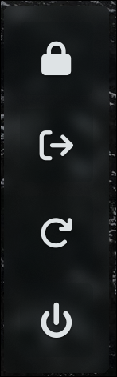

# lfn-shell

> Projeto de desenvolvimento/criação de widgets para serem integrados em meu work flow (Arch + Hyprland). Desenvolvido utilizando o framework [Fabric](https://wiki.ffpy.org/), que por debaixo dos panos utiliza-se do GTK 3 via PyGObject (chamadas python para GTK).

### Componentes:

- [x] clipboard

- [x] power-menu

- [x] launcher apps

- [ ] notifications
- [ ] notification-center
- [ ] status bar
